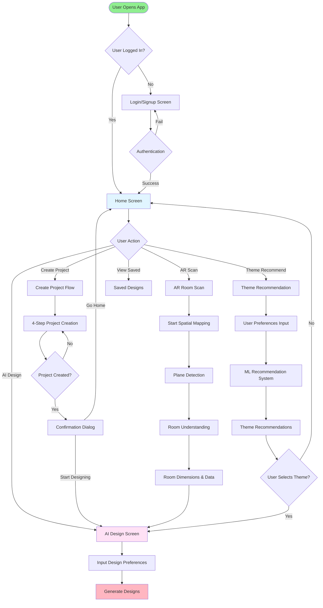
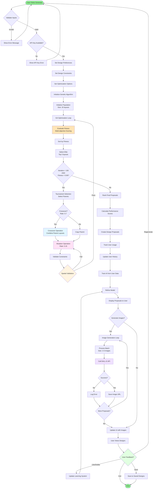
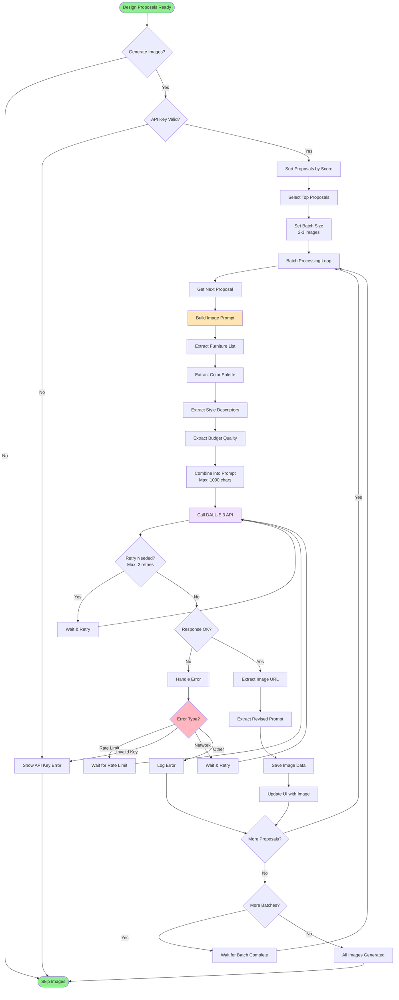
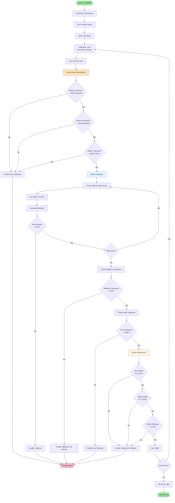

# Complete Process Flowchart - AR Interior Design App

## 1. Main User Journey Flowchart

## 2. AI Design Generation Flowchart (Detailed)

## 3. Genetic Algorithm Detailed Flowchart

```mermaid
flowchart TD
    START([GA Start]) --> INIT[Initialize Population<br/>N = 20 layouts]
    INIT --> GEN_RAND[Generate Random Layouts]
    GEN_RAND --> GEN_FURN[Generate Random Furniture]
    GEN_FURN --> VALID_POS[Validate Positions]
    VALID_POS --> CHECK_VALID{Valid?}
    CHECK_VALID -->|No| GEN_FURN
    CHECK_VALID -->|Yes| POP_READY[Population Ready]
    
    POP_READY --> ITER_START[Start Iteration Loop<br/>Max: 100]
    ITER_START --> EVAL_ALL[Evaluate All Layouts]
    EVAL_ALL --> CALC_FIT[Calculate Fitness<br/>Multi-objective]
    CALC_FIT --> SCORE_SPACE[Space Efficiency Score]
    SCORE_SPACE --> SCORE_COMFORT[Comfort Score]
    SCORE_COMFORT --> SCORE_AEST[Aesthetics Score]
    SCORE_AEST --> SCORE_ACCESS[Accessibility Score]
    SCORE_ACCESS --> SCORE_ERGO[Ergonomics Score]
    SCORE_ERGO --> WEIGHT_SCORE[Apply Weights<br/>Based on Goal]
    WEIGHT_SCORE --> TOTAL_FIT[Total Fitness Score]
    
    TOTAL_FIT --> SORT_POP[Sort Population by Fitness]
    SORT_POP --> SELECT_ELITE[Select Elite<br/>Top 3]
    SELECT_ELITE --> CHECK_CONV{Converged?<br/>Avg Fitness > 0.95}
    
    CHECK_CONV -->|Yes| FINAL_RANK[Final Ranking]
    CHECK_CONV -->|No| CHECK_ITER{Iteration < 100?}
    CHECK_ITER -->|No| FINAL_RANK
    CHECK_ITER -->|Yes| NEW_GEN[Create New Generation]
    
    NEW_GEN --> ADD_ELITE[Add Elite to New Gen]
    ADD_ELITE --> GEN_LOOP{New Gen Size < 20?}
    GEN_LOOP -->|Yes| TOURNAMENT[Tournament Selection<br/>Size: 3]
    TOURNAMENT --> SELECT_PARENT1[Select Parent 1]
    SELECT_PARENT1 --> SELECT_PARENT2[Select Parent 2]
    SELECT_PARENT2 --> CROSS_DEC{Crossover?<br/>Rate: 0.7}
    
    CROSS_DEC -->|Yes| CROSSOVER[Crossover Operation]
    CROSSOVER --> COMBINE_FURN[Combine Furniture from Parents]
    COMBINE_FURN --> COMBINE_POS[Combine Positions]
    COMBINE_POS --> OFFSPRING[Create Offspring]
    
    CROSS_DEC -->|No| OFFSPRING
    OFFSPRING --> MUTATE_DEC{Mutate?<br/>Rate: 0.15}
    MUTATE_DEC -->|Yes| MUTATE[Mutation Operation]
    MUTATE --> MUTATE_POS[Random Position Change]
    MUTATE_POS --> MUTATE_ROT[Random Rotation Change]
    MUTATE_ROT --> MUTATED[Mutated Layout]
    MUTATE_DEC -->|No| MUTATED
    
    MUTATED --> VALIDATE_NEW[Validate New Layout]
    VALIDATE_NEW --> CHECK_BOUND[Check Boundaries]
    CHECK_BOUND --> CHECK_COLL[Check Collisions]
    CHECK_COLL --> CHECK_ERGO[Check Ergonomics]
    CHECK_ERGO --> VALID_NEW{Valid?}
    
    VALID_NEW -->|No| GEN_LOOP
    VALID_NEW -->|Yes| ADD_NEW[Add to New Generation]
    ADD_NEW --> GEN_LOOP
    
    GEN_LOOP -->|No| ITER_START
    FINAL_RANK --> RANK_BEST[Rank by Fitness]
    RANK_BEST --> SELECT_TOP[Select Top N<br/>N = Variations]
    SELECT_TOP --> OUTPUT([Output Best Layouts])
    
    style START fill:#90EE90
    style OUTPUT fill:#90EE90
    style CALC_FIT fill:#FFE4B5
    style CROSSOVER fill:#E1F5FF
    style MUTATE fill:#FFE1F5
    style VALIDATE_NEW fill:#FFF4E1
```

## 4. Image Generation Flowchart

## 5. Spatial Validation Flowchart

## 6. ML Recommendation System Flowchart

```mermaid
flowchart TD
    START([User Requests Recommendations]) --> GET_PREFS[Get User Preferences]
    GET_PREFS --> GET_HIST[Get User History]
    GET_HIST --> GET_IMG{Image Analysis<br/>Available?}
    
    GET_IMG -->|Yes| ANALYZE_IMG[Analyze Room Image]
    ANALYZE_IMG --> EXTRACT_FEAT[Extract Features]
    GET_IMG -->|No| FILTER_THEMES[Filter Theme Database]
    
    EXTRACT_FEAT --> FILTER_THEMES
    FILTER_THEMES --> FILTER_ROOM[Filter by Room Type]
    FILTER_ROOM --> FILTER_STYLE{Style Filter?}
    FILTER_STYLE -->|Yes| FILTER_STYLE_OP[Apply Style Filter]
    FILTER_STYLE -->|No| SCORE_LOOP[Score Each Theme]
    
    FILTER_STYLE_OP --> SCORE_LOOP
    SCORE_LOOP --> GET_THEME[Get Theme Template]
    GET_THEME --> SCORE_ROOM[Score Room Type Match<br/>Weight: 25%]
    SCORE_ROOM --> SCORE_MOOD[Score Mood Match<br/>Weight: 30%]
    SCORE_MOOD --> SCORE_STYLE[Score Style Match<br/>Weight: 25%]
    SCORE_STYLE --> SCORE_COLOR[Score Color Match<br/>Weight: 10%]
    SCORE_COLOR --> SCORE_MAT[Score Material Match<br/>Weight: 10%]
    SCORE_MAT --> CALC_TOTAL[Calculate Total Score]
    CALC_TOTAL --> NEXT_THEME{More Themes?}
    NEXT_THEME -->|Yes| SCORE_LOOP
    NEXT_THEME -->|No| PERSONALIZE{Personalization<br/>Enabled?}
    
    PERSONALIZE -->|Yes| APPLY_PERSON[Apply Personalization]
    APPLY_PERSON --> BOOST_LIKED[Boost Liked Themes]
    BOOST_LIKED --> REDUCE_DISLIKED[Reduce Disliked Themes]
    REDUCE_DISLIKED --> APPLY_PREFS[Apply Preferred Colors/Materials]
    APPLY_PREFS --> PERSONALIZED[Personalized Scores]
    PERSONALIZE -->|No| PERSONALIZED
    
    PERSONALIZED --> FILTER_THRESH[Filter by Threshold<br/>≥ 0.60]
    FILTER_THRESH --> SORT_SCORE[Sort by Confidence Score]
    SORT_SCORE --> SELECT_TOP[Select Top 5]
    SELECT_TOP --> CHECK_COUNT{Count > 0?}
    
    CHECK_COUNT -->|No| LOWER_THRESH[Lower Threshold]
    LOWER_THRESH --> SELECT_TOP
    CHECK_COUNT -->|Yes| CALC_CONF[Calculate Confidence Level]
    CALC_CONF --> CONF_CHECK{Avg Confidence}
    CONF_CHECK -->|> 0.85| HIGH_CONF[High Confidence]
    CONF_CHECK -->|> 0.70| MED_CONF[Medium Confidence]
    CONF_CHECK -->|≤ 0.70| LOW_CONF[Low Confidence]
    
    HIGH_CONF --> OUTPUT([Output Recommendations])
    MED_CONF --> OUTPUT
    LOW_CONF --> OUTPUT
    
    style START fill:#90EE90
    style OUTPUT fill:#90EE90
    style SCORE_LOOP fill:#FFE4B5
    style PERSONALIZE fill:#E1F5FF
    style FILTER_THRESH fill:#FFF4E1
```

## Summary of Flowcharts

1. **Main User Journey**: Complete user flow from app start to design completion
2. **AI Design Generation**: Detailed step-by-step design generation process
3. **Genetic Algorithm**: Internal GA optimization loop with all operations
4. **Image Generation**: DALL-E API integration and error handling
5. **Spatial Validation**: Complete constraint checking process
6. **ML Recommendation**: Theme recommendation system flow

All flowcharts are based on the actual codebase implementation and show the correct sequence of operations.

