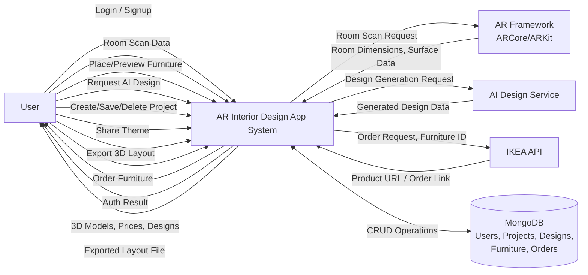

# Data Flow Diagram – Level 0 (Context Diagram)
## AR Interior Design App System

### Overview
This is the **context-level** DFD showing the AR Interior Design App as a single process, with external entities and high-level data flows.

---

### External Entities
1. **User** – Mobile app users (Android/iOS)
2. **AR Framework** – ARCore (Android) or ARKit (iOS) for room scanning
3. **AI Design Service** – External or internal AI service for generating design recommendations
4. **IKEA API** – External API for furniture ordering

---

### Data Stores
- **MongoDB Database** containing:
  - Users collection
  - Projects collection
  - Designs collection
  - Furniture collection
  - Orders collection

---

### Diagram

---

### Data Flows

| **From** | **To** | **Data** |
|----------|--------|----------|
| User | System | Login/signup credentials, room scan requests, furniture selections, AI design requests, project commands, theme sharing, export requests, order requests |
| System | User | Auth tokens, 3D models, prices, designs, exported files, order links |
| System | AR Framework | Room scan request |
| AR Framework | System | Room dimensions, surface data |
| System | AI Service | Design generation request (room data, preferences) |
| AI Service | System | Generated design data |
| System | IKEA API | Order request, furniture ID |
| IKEA API | System | Product URL, order link |
| System | MongoDB | Create, read, update, delete operations on all collections |

---

### Key Features Represented
1. **Authentication** – Login/signup flow
2. **AR Room Scanning** – Capture room dimensions via AR framework
3. **3D Furniture Placement** – Preview furniture in scanned room
4. **AI Design Generation** – Generate design recommendations
5. **Theme Recommendations** – Create and share themes
6. **Project Management** – Save, delete, manage projects
7. **3D Layout Export** – Export room design as 3D file
8. **Order Processing** – Redirect to IKEA for purchases

---

### Notes
- **AR Framework:** ARCore for Android, ARKit for iOS (or Unity AR Foundation for cross-platform)
- **AI Service:** Can be internal (your own ML model) or external (OpenAI, etc.)
- **IKEA API:** External API for product catalog and ordering
- **Database:** MongoDB stores all persistent data (users, projects, designs, furniture, orders)
