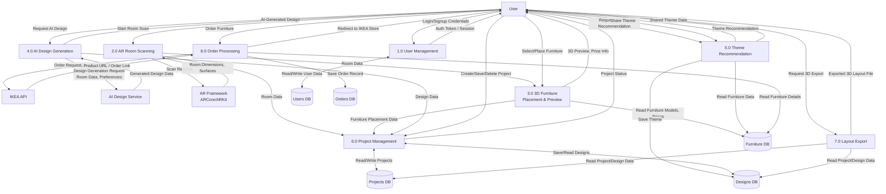

# Data Flow Diagram – Level 1 (Process Decomposition)
## AR Interior Design App System

### Overview
This DFD decomposes the main system into **eight specific processes**, showing detailed data flows between processes, external entities, and data stores.

---

### Processes

1. **1.0 User Management** – Handle login, signup, session management
2. **2.0 AR Room Scanning** – Capture room dimensions using AR framework
3. **3.0 3D Furniture Placement & Preview** – Place and visualize furniture in room
4. **4.0 AI Design Generation** – Generate design recommendations using AI
5. **5.0 Theme Recommendation** – Generate and share design themes
6. **6.0 Project Management** – Create, save, delete user projects
7. **7.0 Layout Export** – Export 3D layout files
8. **8.0 Order Processing** – Process furniture orders via IKEA API

---

### Data Stores (MongoDB Collections)

- **D1: Users DB** – User accounts, authentication data
- **D2: Projects DB** – User projects (room scans, furniture placements)
- **D3: Designs DB** – Saved designs, themes
- **D4: Furniture DB** – Furniture catalog (models, prices, metadata)
- **D5: Orders DB** – Order history and tracking

---

### Diagram

---

### Process Details

#### 1.0 User Management
**Purpose:** Authenticate users and manage sessions  
**Inputs:**
- Login/signup credentials from User
**Outputs:**
- Auth token/session to User
**Data Stores:**
- Users DB (read/write)

---

#### 2.0 AR Room Scanning
**Purpose:** Capture room dimensions using AR framework  
**Inputs:**
- Start scan command from User
**Outputs:**
- Room data to 3.0 (Furniture Placement)
- Room data to 6.0 (Project Management)
**External Systems:**
- AR Framework (ARCore/ARKit) – sends room dimensions and surface data

---

#### 3.0 3D Furniture Placement & Preview
**Purpose:** Allow users to place and preview furniture in scanned room  
**Inputs:**
- Furniture selection from User
- Room data from 2.0 (AR Room Scanning)
**Outputs:**
- 3D preview and price info to User
- Furniture placement data to 6.0 (Project Management)
**Data Stores:**
- Furniture DB (read furniture models, prices)

---

#### 4.0 AI Design Generation
**Purpose:** Generate design recommendations using AI  
**Inputs:**
- Design request from User (room data, preferences)
**Outputs:**
- AI-generated design to User
- Design data to 6.0 (Project Management)
**External Systems:**
- AI Design Service – generates design based on room data

---

#### 5.0 Theme Recommendation
**Purpose:** Generate and share design themes  
**Inputs:**
- Theme request from User
- Share theme command from User
**Outputs:**
- Theme recommendation to User
- Shared theme data to User
**Data Stores:**
- Furniture DB (read)
- Designs DB (write shared themes)

---

#### 6.0 Project Management
**Purpose:** Create, save, and delete user projects  
**Inputs:**
- Create/save/delete commands from User
- Room data from 2.0 (AR Room Scanning)
- Furniture placement data from 3.0 (Furniture Placement)
- Design data from 4.0 (AI Design Generation)
**Outputs:**
- Project status to User
**Data Stores:**
- Projects DB (read/write)
- Designs DB (read/write)

---

#### 7.0 Layout Export
**Purpose:** Export 3D layout files (e.g., OBJ, FBX, GLTF)  
**Inputs:**
- Export request from User
**Outputs:**
- Exported 3D layout file to User
**Data Stores:**
- Projects DB (read project data)
- Designs DB (read design data)

---

#### 8.0 Order Processing
**Purpose:** Process furniture orders via IKEA API  
**Inputs:**
- Order request from User
**Outputs:**
- Redirect to IKEA store (with product URL)
**Data Stores:**
- Furniture DB (read furniture details)
- Orders DB (write order record)
**External Systems:**
- IKEA API – provides product URL and order link

---

### Data Flow Summary

| **Process** | **Input** | **Output** | **Data Store(s)** | **External System(s)** |
|-------------|-----------|------------|-------------------|------------------------|
| 1.0 User Management | Login/signup credentials | Auth token/session | Users DB | - |
| 2.0 AR Room Scanning | Scan request | Room data | - | AR Framework |
| 3.0 Furniture Placement | Furniture selection, room data | 3D preview, prices | Furniture DB | - |
| 4.0 AI Design Generation | Design request | AI-generated design | - | AI Design Service |
| 5.0 Theme Recommendation | Theme request, share command | Theme recommendations | Designs DB, Furniture DB | - |
| 6.0 Project Management | Project commands, room/furniture/design data | Project status | Projects DB, Designs DB | - |
| 7.0 Layout Export | Export request | 3D layout file | Projects DB, Designs DB | - |
| 8.0 Order Processing | Order request | IKEA redirect link | Furniture DB, Orders DB | IKEA API |

---

### Key Features Represented

1. **User authentication** with session management
2. **AR room scanning** via ARCore/ARKit
3. **3D furniture placement** with real-time preview
4. **AI-powered design generation**
5. **Theme recommendations** with social sharing
6. **Project management** (save/delete)
7. **3D layout export** for external use
8. **IKEA integration** for furniture ordering

---

### Notes

- **AR Framework:** Use ARCore (Android), ARKit (iOS), or Unity AR Foundation for cross-platform
- **AI Service:** Can be OpenAI API, custom ML model, or cloud-based service
- **IKEA API:** External API for product catalog and ordering redirect
- **MongoDB:** NoSQL database with collections for users, projects, designs, furniture, orders
- **3D Export Formats:** Common formats include OBJ, FBX, GLTF/GLB, COLLADA
