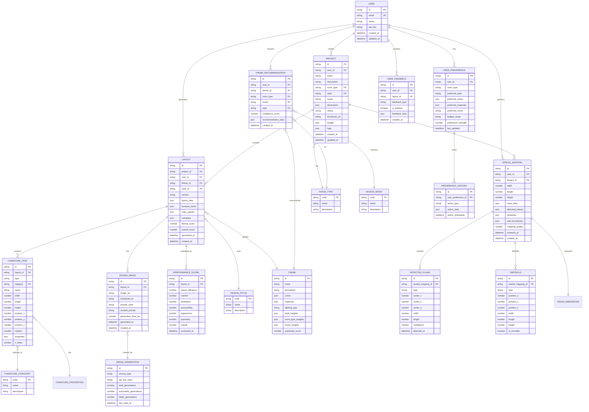
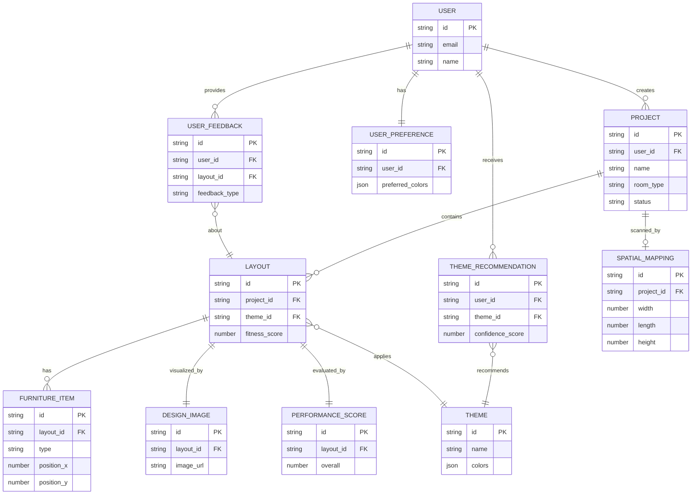

# Entity Relationship Diagram (ERD) - AR Interior Design App

## ⚠️ Database Note

**Current System**: Uses **SQLite** (better-sqlite3) - Relational Database  
**This ERD**: Shows relational database structure (SQL/ERD format)

**If Using MongoDB**: See **[MONGODB_DOCUMENT_MODEL.md](./MONGODB_DOCUMENT_MODEL.md)** for MongoDB document structure

---

## Complete ERD Diagram (Relational/SQLite)



## Detailed Entity Descriptions

### **Core Entities**

#### **USER**
- **Primary Key**: `id`
- **Unique Key**: `email`
- **Description**: System users who create projects and generate designs
- **Relationships**:
  - One-to-Many with PROJECT
  - One-to-Many with LAYOUT
  - One-to-Many with THEME_RECOMMENDATION
  - One-to-Many with USER_PREFERENCE
  - One-to-Many with USER_FEEDBACK
  - One-to-Many with SPATIAL_MAPPING

#### **PROJECT**
- **Primary Key**: `id`
- **Foreign Keys**: `user_id`, `room_type`, `style`
- **Description**: User's design projects containing multiple layouts
- **Relationships**:
  - Many-to-One with USER
  - One-to-Many with LAYOUT
  - One-to-Many with SPATIAL_MAPPING
  - Many-to-One with ROOM_TYPE
- **Key Attributes**:
  - `dimensions`: JSON (width, length, height)
  - `budget`: JSON (min, max)
  - `status`: draft | in-progress | completed

#### **LAYOUT**
- **Primary Key**: `id`
- **Foreign Keys**: `project_id`, `user_id`, `theme_id`, `style_id`
- **Description**: Generated room layout designs with furniture arrangements
- **Relationships**:
  - Many-to-One with PROJECT
  - Many-to-One with USER
  - One-to-Many with FURNITURE_ITEM
  - One-to-Many with DESIGN_IMAGE
  - One-to-One with PERFORMANCE_SCORE
  - Many-to-One with THEME
  - Many-to-One with DESIGN_STYLE
- **Key Attributes**:
  - `layout_data`: JSON (complete layout structure)
  - `furniture_items`: JSON array
  - `fitness_score`: Calculated by GA
  - `overall_score`: Performance evaluation

#### **FURNITURE_ITEM**
- **Primary Key**: `id`
- **Foreign Keys**: `layout_id`, `category`
- **Description**: Individual furniture pieces in a layout
- **Relationships**:
  - Many-to-One with LAYOUT
  - Many-to-One with FURNITURE_CATEGORY
- **Key Attributes**:
  - `position_x`, `position_y`, `position_z`: 3D coordinates
  - `rotation`: Degrees (0, 90, 180, 270)
  - `properties`: JSON (color, material, style, price)

### **Theme & Recommendation Entities**

#### **THEME**
- **Primary Key**: `id`
- **Description**: Design themes with color palettes, materials, and style weights
- **Relationships**:
  - One-to-Many with THEME_RECOMMENDATION
  - One-to-Many with LAYOUT
- **Key Attributes**:
  - `colors`: JSON (primary, secondary, accent, neutral)
  - `style_weights`: JSON (weights for each style)
  - `room_type_weights`: JSON (compatibility scores)

#### **THEME_RECOMMENDATION**
- **Primary Key**: `id`
- **Foreign Keys**: `user_id`, `theme_id`, `room_type`, `mood`, `style`
- **Description**: ML-generated theme recommendations for users
- **Relationships**:
  - Many-to-One with USER
  - Many-to-One with THEME
  - Many-to-One with ROOM_TYPE
  - Many-to-One with DESIGN_MOOD
- **Key Attributes**:
  - `confidence_score`: 0-1 (ML confidence)
  - `recommendation_data`: JSON (full recommendation details)

### **Spatial Mapping Entities**

#### **SPATIAL_MAPPING**
- **Primary Key**: `id`
- **Foreign Keys**: `user_id`, `project_id`
- **Description**: AR-scanned room data with dimensions and detected features
- **Relationships**:
  - Many-to-One with USER
  - Many-to-One with PROJECT
  - One-to-Many with DETECTED_PLANE
  - One-to-Many with OBSTACLE
  - One-to-One with ROOM_DIMENSIONS (embedded)
- **Key Attributes**:
  - `room_data`: JSON (complete room information)
  - `mapping_quality`: 0-100 (scan quality score)

#### **DETECTED_PLANE**
- **Primary Key**: `id`
- **Foreign Key**: `spatial_mapping_id`
- **Description**: Detected surfaces (floors, walls) from AR scanning
- **Relationships**:
  - Many-to-One with SPATIAL_MAPPING
- **Key Attributes**:
  - `type`: horizontal | vertical
  - `confidence`: Detection confidence score

#### **OBSTACLE**
- **Primary Key**: `id`
- **Foreign Key**: `spatial_mapping_id`
- **Description**: Detected obstacles in the room (doors, windows, furniture)
- **Relationships**:
  - Many-to-One with SPATIAL_MAPPING
- **Key Attributes**:
  - `type`: Window | Door | Radiator | Furniture | Other
  - `is_movable`: Boolean

### **Design Output Entities**

#### **DESIGN_IMAGE**
- **Primary Key**: `id`
- **Foreign Key**: `layout_id`
- **Description**: Generated images from DALL-E API for layouts
- **Relationships**:
  - Many-to-One with LAYOUT
  - Many-to-One with IMAGE_GENERATION
- **Key Attributes**:
  - `prompt_used`: Original prompt sent to DALL-E
  - `revised_prompt`: DALL-E's revised prompt
  - `generation_time_ms`: API response time

#### **PERFORMANCE_SCORE**
- **Primary Key**: `id`
- **Foreign Key**: `layout_id`
- **Description**: Multi-dimensional performance evaluation of layouts
- **Relationships**:
  - One-to-One with LAYOUT
- **Key Attributes**:
  - All scores: 0-100
  - `overall`: Weighted average

### **User Learning Entities**

#### **USER_PREFERENCE**
- **Primary Key**: `id`
- **Foreign Key**: `user_id`
- **Description**: Learned user preferences for personalization
- **Relationships**:
  - Many-to-One with USER
  - One-to-Many with PREFERENCE_HISTORY
- **Key Attributes**:
  - `preference_strength`: 0-1 (confidence in preference)
  - `preferred_colors`: JSON array
  - `preferred_materials`: JSON array

#### **USER_FEEDBACK**
- **Primary Key**: `id`
- **Foreign Keys**: `user_id`, `layout_id`
- **Description**: User feedback on generated designs
- **Relationships**:
  - Many-to-One with USER
  - Many-to-One with LAYOUT
- **Key Attributes**:
  - `feedback_type`: like | dislike | save | regenerate
  - `is_positive`: Boolean
  - `feedback_data`: JSON (additional feedback details)

### **Reference/Lookup Entities**

#### **ROOM_TYPE**
- **Primary Key**: `code`
- **Values**: Living Room, Bedroom, Kitchen, Bathroom, Office, Dining Room, Kids Room, Outdoor

#### **DESIGN_STYLE**
- **Primary Key**: `code`
- **Values**: Modern, Contemporary, Minimalist, Scandinavian, Industrial, Bohemian, Traditional, Rustic, Mid-Century, Eclectic

#### **DESIGN_MOOD**
- **Primary Key**: `code`
- **Values**: Cozy, Minimalist, Vibrant, Calm, Luxurious, Rustic, Playful, Professional

#### **FURNITURE_CATEGORY**
- **Primary Key**: `code`
- **Values**: seating, table, storage, decor, lighting, other

---

## Simplified ERD (High-Level View)



## Relationship Summary

| Relationship | Type | Description |
|-------------|------|-------------|
| USER → PROJECT | One-to-Many | User can create multiple projects |
| PROJECT → LAYOUT | One-to-Many | Project contains multiple layout designs |
| LAYOUT → FURNITURE_ITEM | One-to-Many | Layout contains multiple furniture pieces |
| LAYOUT → DESIGN_IMAGE | One-to-Many | Layout can have multiple images |
| LAYOUT → PERFORMANCE_SCORE | One-to-One | Each layout has one performance score |
| USER → THEME_RECOMMENDATION | One-to-Many | User receives multiple recommendations |
| THEME_RECOMMENDATION → THEME | Many-to-One | Recommendations point to themes |
| LAYOUT → THEME | Many-to-One | Layouts apply themes |
| USER → USER_PREFERENCE | One-to-One | User has one preference profile |
| USER → USER_FEEDBACK | One-to-Many | User provides multiple feedbacks |
| USER_FEEDBACK → LAYOUT | Many-to-One | Feedback is about layouts |
| PROJECT → SPATIAL_MAPPING | One-to-Many | Project can have multiple scans |

## Database Schema (SQL Reference)

```sql
-- Users Table
CREATE TABLE users (
    id TEXT PRIMARY KEY,
    email TEXT UNIQUE NOT NULL,
    name TEXT,
    api_key TEXT,
    created_at DATETIME DEFAULT CURRENT_TIMESTAMP,
    updated_at DATETIME DEFAULT CURRENT_TIMESTAMP
);

-- Projects Table
CREATE TABLE projects (
    id TEXT PRIMARY KEY,
    user_id TEXT NOT NULL,
    name TEXT NOT NULL,
    description TEXT,
    room_type TEXT,
    style TEXT,
    mood TEXT,
    dimensions TEXT, -- JSON
    status TEXT DEFAULT 'draft',
    thumbnail_url TEXT,
    budget TEXT, -- JSON
    tags TEXT, -- JSON
    created_at DATETIME DEFAULT CURRENT_TIMESTAMP,
    updated_at DATETIME DEFAULT CURRENT_TIMESTAMP,
    FOREIGN KEY (user_id) REFERENCES users(id)
);

-- Layouts Table
CREATE TABLE layouts (
    id TEXT PRIMARY KEY,
    project_id TEXT,
    user_id TEXT NOT NULL,
    theme_id TEXT,
    style_id TEXT,
    version INTEGER DEFAULT 1,
    layout_data TEXT NOT NULL, -- JSON
    furniture_items TEXT, -- JSON
    color_palette TEXT, -- JSON
    metadata TEXT, -- JSON
    fitness_score REAL,
    overall_score REAL,
    generated_at DATETIME,
    created_at DATETIME DEFAULT CURRENT_TIMESTAMP,
    FOREIGN KEY (project_id) REFERENCES projects(id),
    FOREIGN KEY (user_id) REFERENCES users(id)
);

-- Furniture Items Table
CREATE TABLE furniture_items (
    id TEXT PRIMARY KEY,
    layout_id TEXT NOT NULL,
    type TEXT NOT NULL,
    category TEXT,
    name TEXT,
    width REAL,
    length REAL,
    height REAL,
    position_x REAL,
    position_y REAL,
    position_z REAL,
    rotation REAL,
    properties TEXT, -- JSON
    z_index INTEGER,
    FOREIGN KEY (layout_id) REFERENCES layouts(id) ON DELETE CASCADE
);

-- Themes Table
CREATE TABLE themes (
    id TEXT PRIMARY KEY,
    name TEXT NOT NULL,
    description TEXT,
    colors TEXT NOT NULL, -- JSON
    materials TEXT, -- JSON
    lighting_type TEXT,
    style_weights TEXT, -- JSON
    room_type_weights TEXT, -- JSON
    mood_weights TEXT, -- JSON
    popularity_score REAL DEFAULT 0
);

-- Theme Recommendations Table
CREATE TABLE theme_recommendations (
    id TEXT PRIMARY KEY,
    user_id TEXT NOT NULL,
    theme_id TEXT NOT NULL,
    room_type TEXT,
    mood TEXT,
    style TEXT,
    confidence_score REAL,
    recommendation_data TEXT, -- JSON
    created_at DATETIME DEFAULT CURRENT_TIMESTAMP,
    FOREIGN KEY (user_id) REFERENCES users(id),
    FOREIGN KEY (theme_id) REFERENCES themes(id)
);

-- Spatial Mappings Table
CREATE TABLE spatial_mappings (
    id TEXT PRIMARY KEY,
    user_id TEXT NOT NULL,
    project_id TEXT,
    width REAL,
    length REAL,
    height REAL,
    room_data TEXT, -- JSON
    detected_planes TEXT, -- JSON
    obstacles TEXT, -- JSON
    wall_boundaries TEXT, -- JSON
    mapping_quality REAL,
    scanned_at DATETIME,
    created_at DATETIME DEFAULT CURRENT_TIMESTAMP,
    FOREIGN KEY (user_id) REFERENCES users(id),
    FOREIGN KEY (project_id) REFERENCES projects(id)
);

-- Design Images Table
CREATE TABLE design_images (
    id TEXT PRIMARY KEY,
    layout_id TEXT NOT NULL,
    image_url TEXT NOT NULL,
    thumbnail_url TEXT,
    prompt_used TEXT,
    revised_prompt TEXT,
    generation_time_ms INTEGER,
    generated_at DATETIME,
    created_at DATETIME DEFAULT CURRENT_TIMESTAMP,
    FOREIGN KEY (layout_id) REFERENCES layouts(id) ON DELETE CASCADE
);

-- Performance Scores Table
CREATE TABLE performance_scores (
    id TEXT PRIMARY KEY,
    layout_id TEXT UNIQUE NOT NULL,
    space_efficiency REAL,
    comfort REAL,
    aesthetics REAL,
    accessibility REAL,
    ergonomics REAL,
    symmetry REAL,
    overall REAL,
    evaluated_at DATETIME DEFAULT CURRENT_TIMESTAMP,
    FOREIGN KEY (layout_id) REFERENCES layouts(id) ON DELETE CASCADE
);

-- User Preferences Table
CREATE TABLE user_preferences (
    id TEXT PRIMARY KEY,
    user_id TEXT UNIQUE NOT NULL,
    room_type TEXT,
    preferred_style TEXT,
    preferred_colors TEXT, -- JSON
    preferred_materials TEXT, -- JSON
    preferred_mood TEXT,
    budget_range TEXT,
    preference_strength REAL,
    last_updated DATETIME DEFAULT CURRENT_TIMESTAMP,
    FOREIGN KEY (user_id) REFERENCES users(id) ON DELETE CASCADE
);

-- User Feedback Table
CREATE TABLE user_feedback (
    id TEXT PRIMARY KEY,
    user_id TEXT NOT NULL,
    layout_id TEXT NOT NULL,
    feedback_type TEXT NOT NULL,
    is_positive BOOLEAN,
    feedback_data TEXT, -- JSON
    created_at DATETIME DEFAULT CURRENT_TIMESTAMP,
    FOREIGN KEY (user_id) REFERENCES users(id),
    FOREIGN KEY (layout_id) REFERENCES layouts(id)
);

-- Indexes for Performance
CREATE INDEX idx_projects_user_id ON projects(user_id);
CREATE INDEX idx_layouts_project_id ON layouts(project_id);
CREATE INDEX idx_layouts_user_id ON layouts(user_id);
CREATE INDEX idx_furniture_items_layout_id ON furniture_items(layout_id);
CREATE INDEX idx_theme_recommendations_user_id ON theme_recommendations(user_id);
CREATE INDEX idx_spatial_mappings_project_id ON spatial_mappings(project_id);
CREATE INDEX idx_design_images_layout_id ON design_images(layout_id);
CREATE INDEX idx_user_feedback_layout_id ON user_feedback(layout_id);
```

## Key Design Decisions

1. **JSON Storage**: Complex nested data (dimensions, colors, metadata) stored as JSON for flexibility
2. **Cascade Deletes**: Furniture items and images cascade delete when layout is deleted
3. **Unique Constraints**: User email and user_id in preferences are unique
4. **Indexes**: Created on foreign keys for query performance
5. **Timestamps**: All tables include created_at/updated_at for audit trails
6. **Soft Relationships**: Some relationships (theme, style) use codes rather than strict FKs for flexibility

