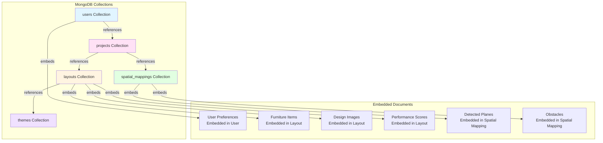

# MongoDB Document Model - AR Interior Design App

## Current Database Status

**Current System**: Uses **SQLite** (better-sqlite3)  
**If Migrating to MongoDB**: This document shows the MongoDB document structure

---

## MongoDB Document Model Diagram



## MongoDB Collections Structure

### 1. **users** Collection

```javascript
{
  _id: ObjectId("..."),
  email: "user@example.com",           // Indexed, Unique
  name: "John Doe",
  apiKey: "sk-...",                    // Indexed, Unique
  preferences: {                        // Embedded Document (optional, can be null)
    roomType: "Living Room",            // "Living Room" | "Bedroom" | "Kitchen" | "Office" | etc.
    preferredStyle: "Modern",           // "Modern" | "Traditional" | "Scandinavian" | etc.
    preferredColors: ["#3B82F6", "#1F2937"],  // Array of hex color codes
    preferredMaterials: ["wood", "fabric"],   // Array of material strings
    preferredMood: "Cozy",               // "Cozy" | "Calm" | "Energetic" | "Minimalist" | etc.
    budgetRange: "medium",               // "low" | "medium" | "high" | "premium"
    preferenceStrength: 0.85,            // 0.0 to 1.0 (how strong the preference is)
    lastUpdated: ISODate("2024-01-01T00:00:00Z")
  },
  preferenceHistory: [                 // Embedded Array
    {
      actionType: "like",              // "like" | "dislike" | "favorite" | "share"
      layoutId: ObjectId("..."),       // Reference to layouts (was incorrectly string)
      timestamp: ISODate("2024-01-01T00:00:00Z")
    }
  ],
  createdAt: ISODate("2024-01-01T00:00:00Z"),
  updatedAt: ISODate("2024-01-01T00:00:00Z")
}
```

**Indexes:**
```javascript
db.users.createIndex({ email: 1 }, { unique: true })
db.users.createIndex({ apiKey: 1 }, { unique: true })
db.users.createIndex({ createdAt: -1 })  // For sorting by creation date
db.users.createIndex({ "preferences.lastUpdated": -1 })  // For preference queries
```

**Field Constraints:**
- `email`: Required, unique, valid email format
- `name`: Required, string (1-100 characters)
- `apiKey`: Required, unique, string (starts with "sk-")
- `preferences.preferenceStrength`: Number, range 0.0 to 1.0
- `preferences.budgetRange`: Enum: "low" | "medium" | "high" | "premium"

---

### 2. **projects** Collection

```javascript
{
  _id: ObjectId("..."),
  userId: ObjectId("..."),              // Reference to users
  name: "My Living Room Design",
  description: "Modern living room with cozy feel",
  roomType: "Living Room",
  style: "Modern",
  mood: "Cozy",
  dimensions: {                         // Embedded Object
    width: 5.0,
    length: 4.0,
    height: 2.5,
    unit: "meters"
  },
  budget: {                             // Embedded Object
    min: 5000,
    max: 10000
  },
  tags: ["modern", "cozy", "living-room"],
  status: "in-progress",                // draft | in-progress | completed
  thumbnailUrl: "https://...",
  layoutIds: [                          // Array of References to layouts
    ObjectId("507f1f77bcf86cd799439011"),  // Valid ObjectId format
    ObjectId("507f1f77bcf86cd799439012")
  ],
  spatialMappingId: ObjectId("..."),    // Reference to spatial_mappings
  createdAt: ISODate("2024-01-01T00:00:00Z"),
  updatedAt: ISODate("2024-01-01T00:00:00Z")
}
```

**Indexes:**
```javascript
db.projects.createIndex({ userId: 1 })
db.projects.createIndex({ status: 1 })
db.projects.createIndex({ createdAt: -1 })
db.projects.createIndex({ userId: 1, status: 1 })  // Compound index for user's projects by status
db.projects.createIndex({ name: "text", description: "text" })  // Text search index
```

**Field Constraints:**
- `userId`: Required, must reference valid user ObjectId
- `name`: Required, string (1-200 characters)
- `status`: Required, enum: "draft" | "in-progress" | "completed" | "archived"
- `dimensions.width`, `dimensions.length`, `dimensions.height`: Required, positive numbers
- `dimensions.unit`: Required, enum: "meters" | "feet" | "inches"
- `budget.min`, `budget.max`: Required, positive numbers, min <= max
- `spatialMappingId`: Optional, must reference valid spatial_mapping ObjectId if provided

---

### 3. **layouts** Collection

```javascript
{
  _id: ObjectId("..."),
  projectId: ObjectId("..."),           // Reference to projects
  userId: ObjectId("..."),              // Reference to users
  themeId: ObjectId("..."),             // Reference to themes
  version: 1,
  style: "Modern",
  colorPalette: ["#3B82F6", "#1F2937", "#FFFFFF"],
  
  furniture: [                          // Embedded Array
    {
      id: "furniture-1",
      type: "sofa",
      category: "seating",
      name: "Modern Sofa",
      dimensions: {
        width: 2.0,
        length: 0.9,
        height: 0.85
      },
      position: {
        x: 2.0,
        y: 0,
        z: 1.5,
        rotation: 90
      },
      properties: {
        color: "#3B82F6",
        material: "fabric",
        style: "modern",
        price: 1200
      },
      zIndex: 1
    }
    // ... more furniture items
  ],
  
  performanceScore: {                  // Embedded Document (optional)
    spaceEfficiency: 85,               // 0-100 (percentage score)
    comfort: 90,                       // 0-100
    aesthetics: 88,                    // 0-100
    accessibility: 82,                 // 0-100
    ergonomics: 87,                    // 0-100
    symmetry: 83,                      // 0-100
    overall: 86                        // 0-100 (calculated average)
  },
  
  images: [                             // Embedded Array
    {
      id: "img-1",
      imageUrl: "https://...",
      thumbnailUrl: "https://...",
      promptUsed: "Professional interior design...",
      revisedPrompt: "A beautifully designed...",
      generationTimeMs: 15000,
      generatedAt: ISODate("2024-01-01T00:00:00Z")
    }
  ],
  
  metadata: {                           // Embedded Object
    generatedAt: ISODate("2024-01-01T00:00:00Z"),
    algorithm: "genetic",
    iterationsCount: 45,
    fitnessScore: 0.86,
    processingTimeMs: 2500
  },
  
  feedback: [                           // Embedded Array
    {
      userId: ObjectId("..."),
      feedbackType: "like",             // "like" | "dislike" | "comment"
      isPositive: true,
      comment: "Love this design!",      // Optional comment text
      createdAt: ISODate("2024-01-01T00:00:00Z")
    }
  ],
  
  createdAt: ISODate("2024-01-01T00:00:00Z"),
  updatedAt: ISODate("2024-01-01T00:00:00Z")  // Added missing field
}
```

**Indexes:**
```javascript
db.layouts.createIndex({ projectId: 1 })
db.layouts.createIndex({ userId: 1 })
db.layouts.createIndex({ themeId: 1 })
db.layouts.createIndex({ "metadata.fitnessScore": -1 })
db.layouts.createIndex({ createdAt: -1 })
db.layouts.createIndex({ projectId: 1, "metadata.fitnessScore": -1 })  // Compound for project's best layouts
db.layouts.createIndex({ "performanceScore.overall": -1 })  // For top-performing layouts
```

**Field Constraints:**
- `projectId`: Required, must reference valid project ObjectId
- `userId`: Required, must reference valid user ObjectId
- `themeId`: Optional, must reference valid theme ObjectId if provided
- `version`: Required, integer >= 1
- `colorPalette`: Array of valid hex color codes (#RRGGBB format)
- `furniture[].position.x, y, z`: Numbers (coordinates in meters)
- `furniture[].position.rotation`: Number, 0-360 (degrees)
- `performanceScore.*`: Numbers, range 0-100 (percentage scores)
- `metadata.fitnessScore`: Number, range 0.0 to 1.0

---

### 4. **themes** Collection

```javascript
{
  _id: ObjectId("..."),
  name: "Modern Scandinavian",
  description: "Clean lines with natural materials",
  
  colors: {                              // Embedded Object
    primary: ["#3B82F6", "#1F2937"],
    secondary: ["#E5E7EB", "#F3F4F6"],
    accent: ["#F59E0B", "#10B981"],
    neutral: ["#FFFFFF", "#F9FAFB"]
  },
  colorPalette: ["#3B82F6", "#1F2937", "#E5E7EB", "#F3F4F6"],
  
  materials: ["wood", "fabric", "metal"],
  textures: ["smooth", "natural"],
  lightingType: "natural daylight",
  
  styleWeights: {                       // Embedded Object
    "Modern": 0.9,
    "Minimalist": 0.8,
    "Scandinavian": 1.0,
    "Industrial": 0.3
  },
  
  roomTypeWeights: {                    // Embedded Object
    "Living Room": 0.95,
    "Bedroom": 0.85,
    "Kitchen": 0.70,
    "Office": 0.60
  },
  
  moodWeights: {                        // Embedded Object
    "Cozy": 0.9,
    "Calm": 0.85,
    "Minimalist": 0.8
  },
  
  popularityScore: 0.75,
  createdAt: ISODate("2024-01-01T00:00:00Z")
}
```

**Indexes:**
```javascript
db.themes.createIndex({ name: 1 }, { unique: true })  // Theme names should be unique
db.themes.createIndex({ popularityScore: -1 })
db.themes.createIndex({ name: "text", description: "text" })  // Text search index
```

**Field Constraints:**
- `name`: Required, unique, string (1-100 characters)
- `description`: Optional, string (max 500 characters)
- `colorPalette`: Array of valid hex color codes
- `materials`: Array of strings (valid material types)
- `lightingType`: String (e.g., "natural daylight", "warm", "cool")
- `styleWeights.*`: Numbers, range 0.0 to 1.0 (weight values)
- `roomTypeWeights.*`: Numbers, range 0.0 to 1.0
- `moodWeights.*`: Numbers, range 0.0 to 1.0
- `popularityScore`: Number, range 0.0 to 1.0

---

### 5. **theme_recommendations** Collection

```javascript
{
  _id: ObjectId("..."),
  userId: ObjectId("..."),              // Reference to users
  themeId: ObjectId("..."),             // Reference to themes
  roomType: "Living Room",
  mood: "Cozy",
  style: "Modern",
  confidenceScore: 0.92,
  
  recommendationData: {                  // Embedded Object
    theme: {
      name: "Modern Scandinavian",
      colors: [...],
      materials: [...]
    },
    reasoning: "Matches your preference for modern style...",
    alternatives: [
      {
        themeId: ObjectId("..."),
        confidenceScore: 0.85
      }
    ]
  },
  
  createdAt: ISODate("2024-01-01T00:00:00Z")
}
```

**Indexes:**
```javascript
db.theme_recommendations.createIndex({ userId: 1, createdAt: -1 })
db.theme_recommendations.createIndex({ confidenceScore: -1 })
db.theme_recommendations.createIndex({ userId: 1, confidenceScore: -1 })  // Compound for user's best recommendations
db.theme_recommendations.createIndex({ themeId: 1 })  // For theme-based queries
```

**Field Constraints:**
- `userId`: Required, must reference valid user ObjectId
- `themeId`: Required, must reference valid theme ObjectId
- `roomType`: Required, string (valid room type)
- `mood`: Required, string (valid mood type)
- `style`: Required, string (valid style type)
- `confidenceScore`: Required, number, range 0.0 to 1.0

---

### 6. **spatial_mappings** Collection

```javascript
{
  _id: ObjectId("..."),
  userId: ObjectId("..."),              // Reference to users
  projectId: ObjectId("..."),           // Reference to projects
  
  roomDimensions: {                     // Embedded Object
    width: 5.0,                         // Positive number (meters/feet/inches)
    length: 4.0,                        // Positive number
    height: 2.5,                        // Positive number
    unit: "meters",                     // "meters" | "feet" | "inches"
    accuracy: 97                        // 0-100 (percentage accuracy of measurement)
  },
  
  roomData: {                           // Embedded Object
    area: 20.0,
    volume: 50.0,
    floorType: "hardwood",
    naturalLight: "abundant",
    confidence: 0.95
  },
  
  detectedPlanes: [                     // Embedded Array
    {
      id: "plane-1",
      type: "horizontal",
      center: { x: 2.5, y: 0, z: 2.0 },
      normal: { x: 0, y: 1, z: 0 },
      width: 5.0,
      length: 4.0,
      area: 20.0,
      confidence: 0.98,
      detectedAt: ISODate("2024-01-01T00:00:00Z")
    }
  ],
  
  obstacles: [                          // Embedded Array
    {
      id: "obstacle-1",
      type: "Door",
      label: "Main Entrance",
      position: { x: 0, y: 0, z: 2.0 },
      dimensions: {
        width: 0.9,
        length: 0.1,
        height: 2.1
      },
      isMovable: false,
      confidence: 0.95
    }
  ],
  
  wallBoundaries: [                     // Embedded Array
    {
      id: "wall-1",
      orientation: "north",
      startPoint: { x: 0, y: 0, z: 0 },
      endPoint: { x: 5, y: 0, z: 0 },
      length: 5.0
    }
  ],
  
  mappingQuality: 0.95,                 // 0.0 to 1.0 (quality score)
  scannedAt: ISODate("2024-01-01T00:00:00Z"),
  createdAt: ISODate("2024-01-01T00:00:00Z"),
  updatedAt: ISODate("2024-01-01T00:00:00Z")  // Added missing field
}
```

**Indexes:**
```javascript
db.spatial_mappings.createIndex({ userId: 1 })
db.spatial_mappings.createIndex({ projectId: 1 })
db.spatial_mappings.createIndex({ scannedAt: -1 })
db.spatial_mappings.createIndex({ userId: 1, scannedAt: -1 })  // Compound for user's recent scans
db.spatial_mappings.createIndex({ mappingQuality: -1 })  // For quality-based queries
```

**Field Constraints:**
- `userId`: Required, must reference valid user ObjectId
- `projectId`: Required, must reference valid project ObjectId
- `roomDimensions.width`, `length`, `height`: Required, positive numbers
- `roomDimensions.unit`: Required, enum: "meters" | "feet" | "inches"
- `roomDimensions.accuracy`: Number, range 0-100 (percentage)
- `roomData.area`, `volume`: Required, positive numbers
- `roomData.confidence`: Number, range 0.0 to 1.0
- `detectedPlanes[].confidence`: Number, range 0.0 to 1.0
- `obstacles[].confidence`: Number, range 0.0 to 1.0
- `mappingQuality`: Number, range 0.0 to 1.0

---

## MongoDB vs SQLite Comparison

### **Key Differences**

| Aspect | SQLite (Current) | MongoDB (If Migrated) |
|--------|------------------|------------------------|
| **Structure** | Tables & Rows | Collections & Documents |
| **Relationships** | Foreign Keys | References (ObjectId) or Embedded |
| **Data Types** | TEXT, INTEGER, REAL | Rich BSON types (Object, Array, Date) |
| **Queries** | SQL | MongoDB Query Language |
| **Joins** | SQL JOINs | $lookup or application-level |
| **Schema** | Fixed schema | Flexible schema (can vary) |
| **JSON Storage** | TEXT field (stringified) | Native JSON/BSON |

### **Advantages of MongoDB for This App**

1. **Native JSON Support**: No need to stringify/parse JSON
2. **Embedded Documents**: Furniture items, images, scores can be embedded in layouts
3. **Flexible Schema**: Easy to add new fields without migrations
4. **Array Support**: Native arrays for furniture, images, feedback
5. **Better for Nested Data**: Room data, spatial mappings fit naturally

### **Design Decisions for MongoDB**

#### **Embedded vs Referenced**

**Embedded (Denormalized):**
- ✅ Furniture items in layouts (always accessed together)
- ✅ Performance scores in layouts (one-to-one)
- ✅ Design images in layouts (always shown together)
- ✅ User preferences in users (one-to-one)
- ✅ Detected planes in spatial mappings (always together)
- ✅ Obstacles in spatial mappings (always together)

**Referenced (Normalized):**
- ✅ Projects reference users (userId: ObjectId)
- ✅ Layouts reference projects (projectId: ObjectId)
- ✅ Layouts reference themes (themeId: ObjectId)
- ✅ Theme recommendations reference themes (themeId: ObjectId)

---

## MongoDB Schema Examples

### **Example Query: Get User with Projects and Layouts**

```javascript
// Get user with all projects
const user = await db.collection('users').findOne(
  { email: 'user@example.com' },
  { projection: { apiKey: 0 } } // Exclude sensitive data
);

// Get user's projects
const projects = await db.collection('projects').find(
  { userId: user._id }
).toArray();

// Get layouts for a project (with embedded furniture and images)
const layouts = await db.collection('layouts').find(
  { projectId: projectId }
).toArray();
// Furniture, images, and scores are already embedded!
```

### **Example Query: Get Layout with Theme**

```javascript
// Option 1: Two queries
const layout = await db.collection('layouts').findOne({ _id: layoutId });
const theme = await db.collection('themes').findOne({ _id: layout.themeId });

// Option 2: Aggregation with $lookup
const result = await db.collection('layouts').aggregate([
  { $match: { _id: layoutId } },
  {
    $lookup: {
      from: 'themes',
      localField: 'themeId',
      foreignField: '_id',
      as: 'theme'
    }
  },
  { $unwind: '$theme' }
]).toArray();
```

### **Example Query: Get Top Layouts by Fitness Score**

```javascript
const topLayouts = await db.collection('layouts')
  .find({ projectId: projectId })
  .sort({ 'metadata.fitnessScore': -1 })
  .limit(5)
  .toArray();
```

### **Example Query: Search Projects by Name or Description**

```javascript
// Using text search index
const projects = await db.collection('projects')
  .find({ $text: { $search: "modern living room" } })
  .sort({ score: { $meta: "textScore" } })
  .toArray();
```

### **Example Query: Get User's Recent Projects with Status**

```javascript
// Using compound index for efficient query
const projects = await db.collection('projects')
  .find({ 
    userId: userId,
    status: "in-progress"
  })
  .sort({ createdAt: -1 })
  .limit(10)
  .toArray();
```

### **Example Query: Update Layout with Validation**

```javascript
// Update layout with proper validation
const result = await db.collection('layouts').findOneAndUpdate(
  { _id: layoutId },
  { 
    $set: { 
      "performanceScore.overall": newScore,
      updatedAt: new Date()
    }
  },
  { 
    returnDocument: 'after',
    // Ensure score is within valid range
    upsert: false
  }
);
```

---

## Best Practices

### **1. Index Strategy**
- Create indexes on frequently queried fields
- Use compound indexes for multi-field queries
- Monitor index usage and remove unused indexes
- Consider partial indexes for filtered queries

### **2. Data Consistency**
- Validate ObjectId references before insertion
- Use transactions for multi-document operations (MongoDB 4.0+)
- Implement application-level referential integrity checks
- Use `$lookup` aggregation for joins when needed

### **3. Performance Optimization**
- Limit array sizes in embedded documents (consider referencing if arrays grow large)
- Use projection to fetch only needed fields
- Implement pagination for large result sets
- Cache frequently accessed data (themes, user preferences)

### **4. Security**
- Never expose `apiKey` in queries (use projection to exclude)
- Validate all user inputs before database operations
- Use parameterized queries to prevent injection
- Implement proper authentication and authorization

### **5. Data Modeling**
- Keep embedded documents under 16MB (MongoDB document size limit)
- Consider splitting large arrays into separate collections if they grow unbounded
- Use references for data that changes frequently or is shared across many documents
- Embed data that is always accessed together

---

## Migration Considerations

### **If Migrating from SQLite to MongoDB:**

1. **Data Migration Script Needed**
   - Convert SQLite tables to MongoDB collections
   - Parse JSON strings to native objects
   - Convert foreign keys to ObjectId references
   - Validate data integrity after migration
   - Create all necessary indexes

2. **Application Code Changes**
   - Replace SQL queries with MongoDB queries
   - Update ORM/ODM if using one (e.g., Mongoose for Node.js)
   - Change data access patterns
   - Update error handling for MongoDB-specific errors
   - Implement connection pooling

3. **Benefits After Migration**
   - Better performance for nested data
   - Easier to add new fields (no schema migrations)
   - Native JSON support (no stringify/parse overhead)
   - Better scalability (horizontal scaling with sharding)
   - Flexible schema evolution

4. **Migration Checklist**
   - [ ] Backup SQLite database
   - [ ] Create MongoDB database and collections
   - [ ] Write and test migration script
   - [ ] Create all indexes
   - [ ] Validate data integrity
   - [ ] Update application code
   - [ ] Test all queries and operations
   - [ ] Monitor performance after migration

---

## Data Validation & Constraints

### **Common Validation Rules**

1. **ObjectId References**: All foreign key references must be valid ObjectIds that exist in their respective collections
2. **Date Fields**: All ISODate fields must be valid ISO 8601 date strings
3. **Score Ranges**: 
   - Percentage scores: 0-100 (integers or floats)
   - Normalized scores: 0.0-1.0 (floats)
4. **Color Codes**: Must be valid hex format (#RRGGBB or #RRGGBBAA)
5. **Dimensions**: All width, length, height values must be positive numbers
6. **Arrays**: Can be empty arrays `[]` but should not be `null` (use empty array instead)

### **Required vs Optional Fields**

**Always Required:**
- `_id` (auto-generated)
- `userId` (in projects, layouts, spatial_mappings)
- `email` (in users)
- `name` (in projects, themes)
- `createdAt` (all collections)

**Conditionally Required:**
- `projectId` in layouts (required if layout belongs to a project)
- `themeId` in layouts (optional, can be null)
- `spatialMappingId` in projects (optional)
- `preferences` in users (optional, can be null)

---

## Error Handling Examples

### **Example: Handling Invalid References**

```javascript
// Check if referenced user exists before creating project
const user = await db.collection('users').findOne({ _id: userId });
if (!user) {
  throw new Error('Invalid userId: User does not exist');
}

// Create project with valid reference
const project = await db.collection('projects').insertOne({
  userId: userId,
  name: "My Project",
  // ... other fields
});
```

### **Example: Validating Data Before Insert**

```javascript
// Validate layout data before insertion
function validateLayout(layout) {
  if (!layout.projectId || !ObjectId.isValid(layout.projectId)) {
    throw new Error('Invalid projectId');
  }
  if (layout.performanceScore) {
    const scores = layout.performanceScore;
    Object.keys(scores).forEach(key => {
      if (scores[key] < 0 || scores[key] > 100) {
        throw new Error(`Invalid ${key} score: must be 0-100`);
      }
    });
  }
  return true;
}
```

---

## Summary

**Current System**: SQLite (Relational)  
**If Using MongoDB**: Document-based with embedded and referenced documents

**Key MongoDB Collections:**
1. `users` - User accounts with embedded preferences
2. `projects` - Design projects
3. `layouts` - Generated layouts with embedded furniture, images, scores
4. `themes` - Design themes
5. `theme_recommendations` - ML recommendations
6. `spatial_mappings` - AR scan data with embedded planes and obstacles

**Design Pattern**: Hybrid approach
- **Embedded**: Data always accessed together (furniture in layouts)
- **Referenced**: Data shared across documents (themes, users)

**Key Improvements Made:**
- ✅ Fixed ObjectId usage errors (layoutId, invalid ObjectId examples)
- ✅ Added missing `updatedAt` fields
- ✅ Added comprehensive field constraints and validation rules
- ✅ Added compound indexes for better query performance
- ✅ Added text search indexes for searchable fields
- ✅ Enhanced documentation with data type constraints and enum values
- ✅ Added error handling examples

