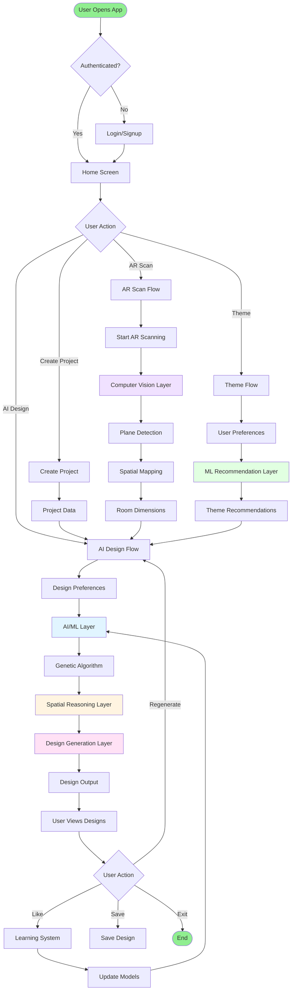
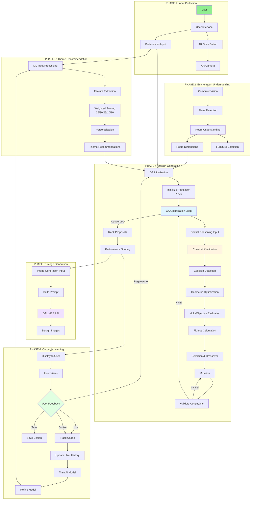
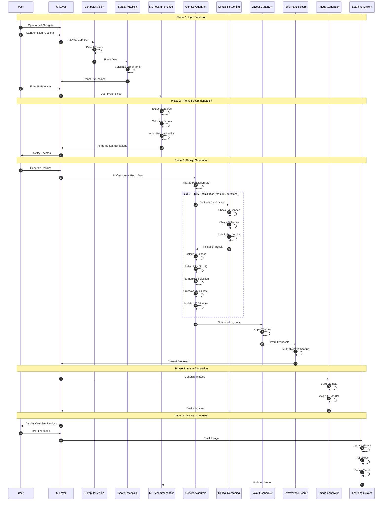
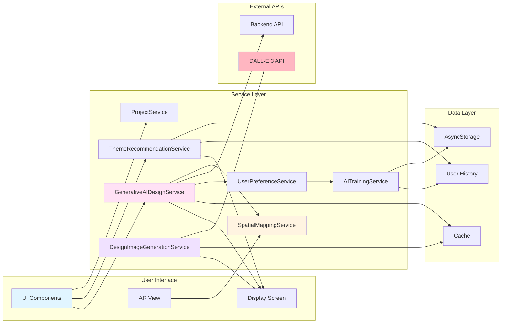
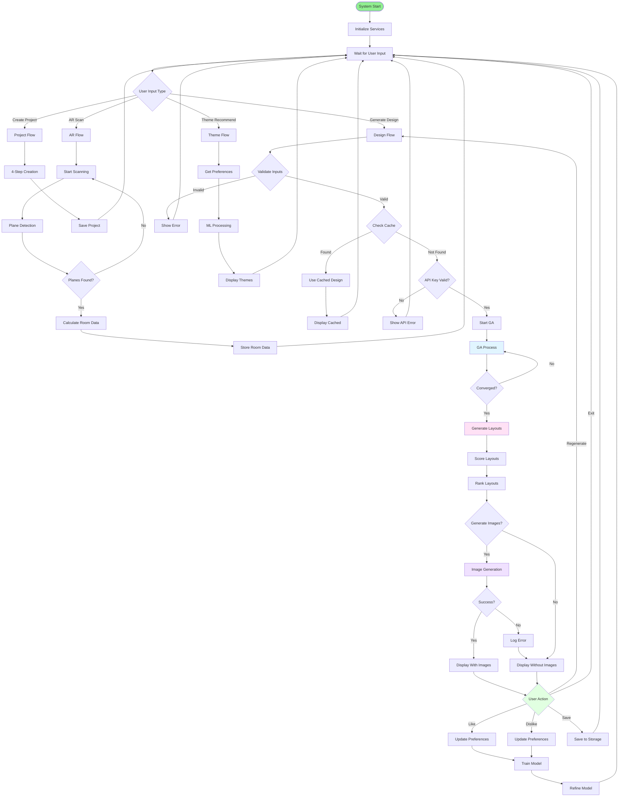

# Complete System Flow Diagram

## 1. End-to-End System Flow (High-Level)



## 2. Complete System Flow with All Layers



## 3. Data Flow Through System Layers



## 4. Component Interaction Flow



## 5. System Flow with Decision Points



## 6. System Flow Summary Table

| Phase | Component | Input | Process | Output | Next Phase |
|-------|-----------|-------|---------|--------|------------|
| **1. Input** | UI Layer | User Actions | Collect Preferences | Preferences Data | Phase 2/3 |
| **2. AR Scan** | CV Layer | Camera Feed | Plane Detection | Room Dimensions | Phase 4 |
| **3. Theme** | ML Layer | User Preferences | Weighted Scoring | Theme Recommendations | Phase 4 |
| **4. Design** | GA + Spatial | Preferences + Room | Genetic Algorithm | Layout Proposals | Phase 5 |
| **5. Images** | Image Service | Layout Proposals | DALL-E API | Design Images | Phase 6 |
| **6. Learning** | Learning System | User Feedback | Model Training | Refined Model | Phase 3 |

## 7. Key Flow Characteristics

### **Linear Flow (Main Path)**
```
User Input → Theme Recommendation → Design Generation → Image Generation → Display
```

### **Parallel Processing**
- Theme recommendation can run in parallel with AR scanning
- Multiple layout proposals generated simultaneously
- Batch image generation (2-3 at a time)

### **Feedback Loops**
1. **Short Loop**: User feedback → Model refinement → Next recommendation
2. **Long Loop**: User feedback → Training → Model update → All future generations

### **Caching & Optimization**
- Design results cached for 24 hours
- Offline mode support with cached data
- Batch processing for memory management

### **Error Handling Flow**
```
Error → Retry (Max 2-3 times) → Fallback → User Notification → Continue/Abort
```

## 8. System Flow Metrics

| Metric | Value | Location |
|--------|-------|----------|
| **GA Population Size** | 20 layouts | GenerativeAIDesignService |
| **GA Max Iterations** | 100 | GenerativeAIDesignService |
| **Crossover Rate** | 70% | GenerativeAIDesignService |
| **Mutation Rate** | 15% | GenerativeAIDesignService |
| **Elite Count** | 3 | GenerativeAIDesignService |
| **Image Batch Size** | 2-3 images | ai-design.tsx |
| **Cache Duration** | 24 hours | ai-design.tsx |
| **Max Retries** | 2-3 attempts | Multiple services |
| **Theme Threshold** | 0.60 | ThemeRecommendationService |

## Summary

The system flows through **6 main phases**:
1. **Input Collection** - User preferences and AR scanning
2. **Environment Understanding** - Computer vision and spatial mapping
3. **Theme Recommendation** - ML-based personalization
4. **Design Generation** - Genetic algorithm with spatial reasoning
5. **Image Generation** - DALL-E API integration
6. **Learning & Refinement** - Continuous improvement from feedback

The flow includes **parallel processing**, **caching**, **error handling**, and **feedback loops** for continuous learning and optimization.

