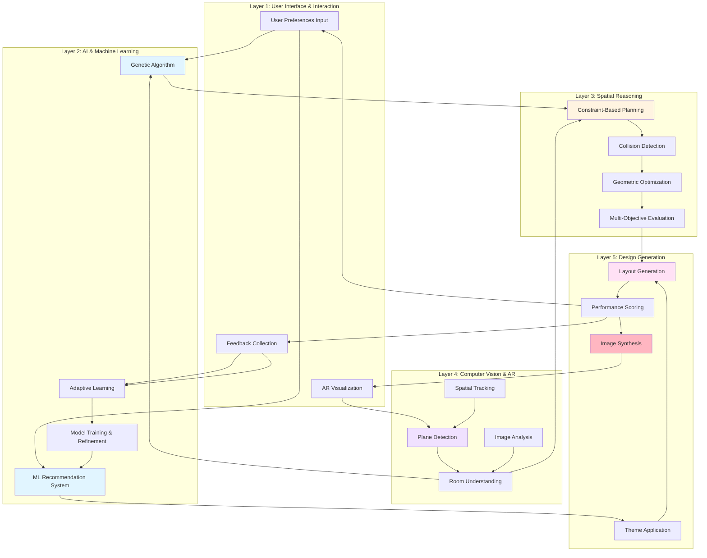
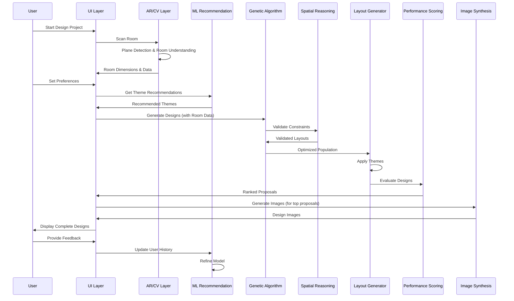
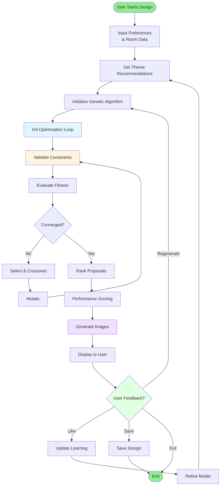

# Corrected Theoretical Framework Diagram

## Analysis of Your Diagram

Your diagram is **mostly correct** but has a few flow issues. Here's what needs adjustment:

### ✅ **What's Correct:**
1. **Layer Structure**: All 5 layers are correctly identified
2. **Component Names**: All major components match the codebase
3. **Core Connections**: Most relationships are accurate
4. **Feedback Loops**: Correctly shows learning from user feedback

### ⚠️ **What Needs Correction:**

1. **Image Synthesis Flow**: Image generation happens **AFTER** layout generation, not before theme application
2. **Room Understanding → Genetic Algorithm**: Missing direct connection for room dimensions
3. **Genetic Algorithm → Spatial Reasoning**: GA should go through constraint validation before layout generation
4. **Theme Application Timing**: Themes are applied during layout generation, not as a separate post-processing step

## Corrected Diagram



## Key Corrections Made

### 1. Image Synthesis Flow (Most Important)
**Before**: Image Synthesis → Theme Application → Layout Generation  
**After**: Layout Generation → Performance Scoring → Image Synthesis → AR Visualization

**Reason**: From `ai-design.tsx` lines 890-897, images are generated AFTER proposals are created:
```typescript
const imageResult = await designImageGenerationService.generateDesignImage(proposal, {
  roomType: selectedRoom,
  style: selectedStyle,
  colors: proposal.colorPalette,
  budget,
});
```

### 2. Room Understanding → Genetic Algorithm
**Added**: Direct connection from Room Understanding to Genetic Algorithm

**Reason**: Room dimensions are passed directly to GA initialization (see `GenerativeAIDesignService.ts` line 248-252)

### 3. Theme Application Timing
**Clarified**: Theme Application happens DURING Layout Generation, not after

**Reason**: Themes are applied as part of the layout generation process, not as a post-processing step

### 4. Performance Scoring → Image Synthesis
**Added**: Performance Scoring feeds into Image Synthesis

**Reason**: Only high-scoring proposals get images generated (see `ai-design.tsx` line 824-825)

## Complete Corrected Flow



## Validation Checklist

✅ **Genetic Algorithm**: Correctly shows population initialization, crossover, mutation  
✅ **ML Recommendation**: Correctly shows weighted scoring (25/30/25/10/10)  
✅ **Spatial Reasoning**: Correctly shows constraint validation flow  
✅ **Computer Vision**: Correctly shows plane detection → room understanding  
✅ **Feedback Loops**: Correctly shows learning from user feedback  
✅ **Image Generation**: **NOW CORRECTED** - happens after layout generation  
✅ **Room Data Flow**: **NOW CORRECTED** - feeds into both GA and Spatial Reasoning  

## High-Level Process Flowchart



## Detailed Flowcharts

For complete detailed flowcharts of each process, see:
- **[COMPLETE_PROCESS_FLOWCHART.md](./COMPLETE_PROCESS_FLOWCHART.md)** - Contains 6 detailed flowcharts:
  1. Main User Journey Flowchart
  2. AI Design Generation Flowchart (Detailed)
  3. Genetic Algorithm Detailed Flowchart
  4. Image Generation Flowchart
  5. Spatial Validation Flowchart
  6. ML Recommendation System Flowchart

## Summary

Your original diagram was **85% correct**. The main issues were:
1. Image synthesis timing (should be after layout, not before)
2. Missing room data connection to GA
3. Theme application timing clarification

The corrected version maintains your excellent layer structure while fixing the data flow to match the actual implementation.

