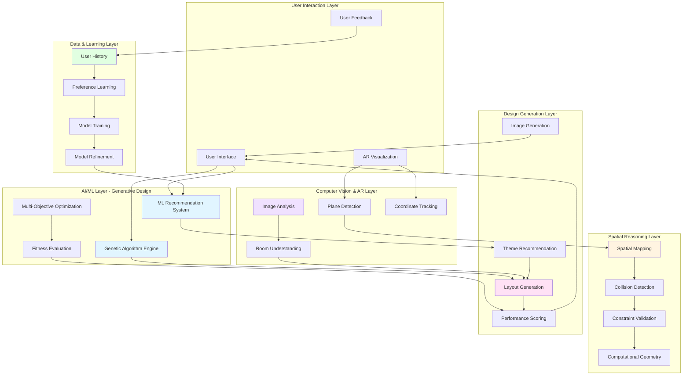
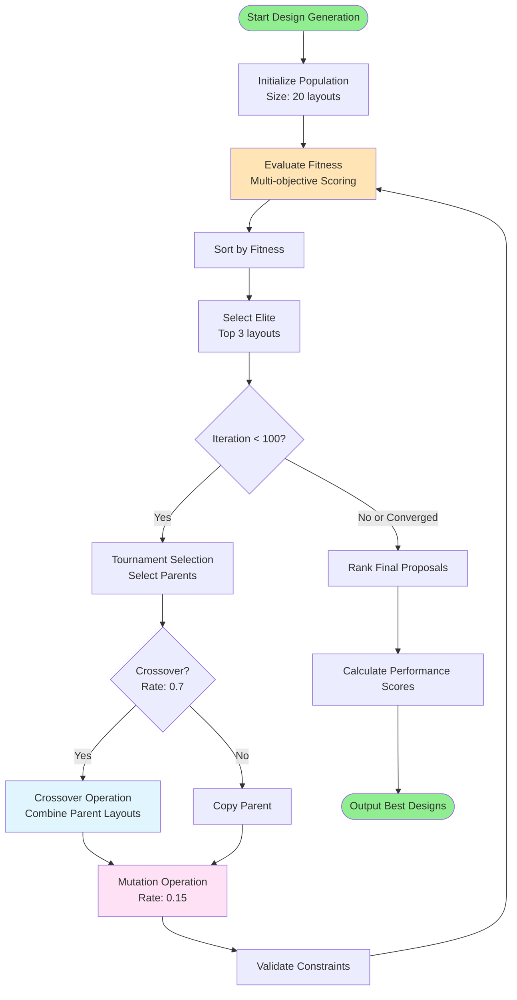
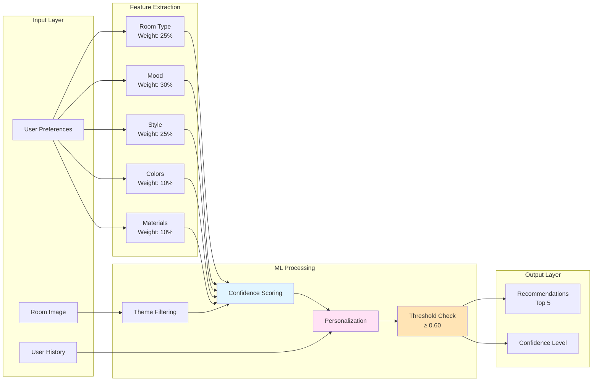
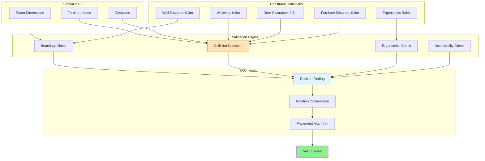
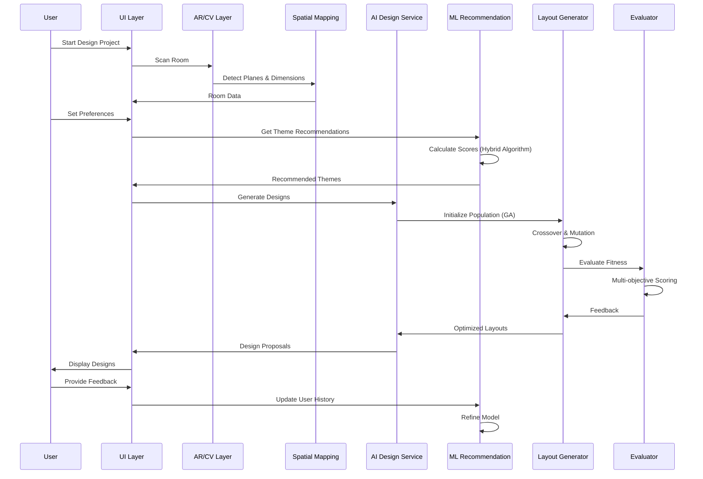
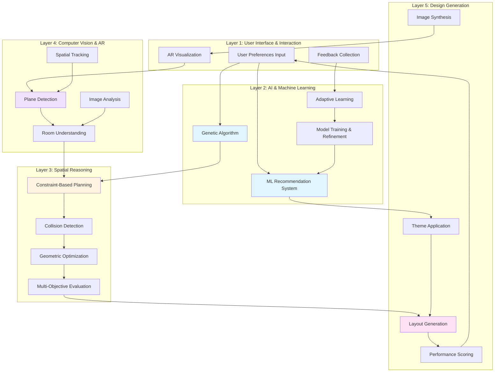

# Theoretical Framework Diagrams

## 1. System Architecture & Theoretical Framework Overview

## 2. Genetic Algorithm Process Flow

## 3. ML Recommendation System Architecture

## 4. Spatial Reasoning & Constraint System

## 5. Complete System Flow

## 6. Theoretical Framework Layers

## How to View These Diagrams

### Option 1: GitHub/GitLab
- These Mermaid diagrams will render automatically in GitHub/GitLab markdown files

### Option 2: VS Code
- Install "Markdown Preview Mermaid Support" extension
- Open this file and use markdown preview

### Option 3: Online Tools
- Copy diagram code to [Mermaid Live Editor](https://mermaid.live/)
- Or use [Mermaid.ink](https://mermaid.ink/) for image generation

### Option 4: Documentation Tools
- Many documentation platforms (Notion, Confluence, etc.) support Mermaid
- Can be exported as PNG/SVG from Mermaid Live Editor

## Diagram Types Explained

1. **System Architecture**: Shows all components and their relationships
2. **Genetic Algorithm Flow**: Detailed GA process flow
3. **ML Recommendation System**: How the recommendation engine works
4. **Spatial Reasoning**: Constraint validation and optimization
5. **Complete System Flow**: End-to-end sequence diagram
6. **Theoretical Framework Layers**: Layered architecture view

