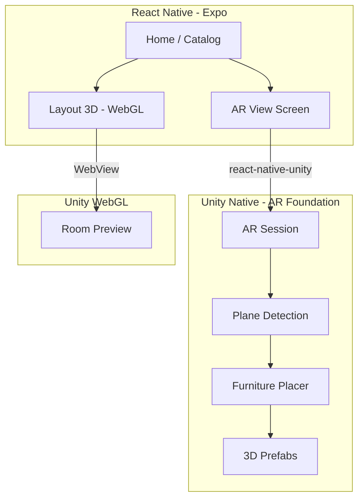

# IKEA-Style AR Furniture — Unity + AR Foundation + React Native

Complete step-by-step guide to place **true-to-scale 3D furniture in a real room** (IKEA Place / Myty style) and embed it in **AR Interior Design App**.

---

## Table of contents

1. [What you are building](#1-what-you-are-building)
2. [What you already have](#2-what-you-already-have)
3. [Prerequisites](#3-prerequisites)
4. [Architecture](#4-architecture)
5. [Phase A — Install Unity modules](#5-phase-a--install-unity-modules)
6. [Phase B — Create AR Foundation project](#6-phase-b--create-ar-foundation-project)
7. [Phase C — AR scene setup (step by step)](#7-phase-c--ar-scene-setup-step-by-step)
8. [Phase D — Furniture models & materials](#8-phase-d--furniture-models--materials)
9. [Phase E — C# scripts](#9-phase-e--c-scripts)
10. [Phase F — Build Unity for Android / iOS](#10-phase-f--build-unity-for-android--ios)
11. [Phase G — Integrate with React Native (Expo)](#11-phase-g--integrate-with-react-native-expo)
12. [Phase H — Wire the AR View tab](#12-phase-h--wire-the-ar-view-tab)
13. [Communication protocol](#13-communication-protocol)
14. [Testing checklist](#14-testing-checklist)
15. [Troubleshooting](#15-troubleshooting)
16. [Roadmap after MVP](#16-roadmap-after-mvp)

---

## 1. What you are building

| IKEA Place | Your target |
|------------|-------------|
| Camera shows real room | AR Foundation + device camera |
| Detect floor / surfaces | AR Plane Manager |
| Tap to place sofa | Raycast → spawn prefab |
| Object stays when you move | AR anchor / tracked plane |
| Realistic 3D model | GLB / FBX prefab with PBR materials |
| App shell (menus, catalog) | React Native (Expo) |

**Important:** WebGL (what you use in Layout 3D) **cannot** do this on a phone. IKEA-style AR requires a **native Unity build** with **AR Foundation**.

---

## 2. What you already have

| Piece | Location | Use |
|-------|----------|-----|
| Unity WebGL viewer | `index.html` + `InteriorDesignViewer/` | Layout 3D preview (keep this) |
| Unity scripts | `InteriorDesignViewer/Assets/Scripts/` | Extend for AR |
| React Native app | `frontend/` | UI, navigation, catalog |
| AR View screen | `frontend/app/ar-view.tsx` | **Replace** Three.js overlay with Unity AR |
| Dev client | `expo-dev-client` in `package.json` | Required for native Unity |
| EAS config | `frontend/eas.json` | Build custom app binary |

**Strategy:** Keep **two Unity outputs**:

- **WebGL** → `Layout 3D` (room preview) — already working  
- **Android / iOS library** → `AR View` (IKEA-style AR) — this guide  

---

## 3. Prerequisites

### Hardware & software

| Requirement | Notes |
|-------------|--------|
| **PC** | ~25+ GB free for Unity + Android + iOS modules |
| **Android phone** | ARCore supported ([device list](https://developers.google.com/ar/devices)) |
| **iPhone** (optional) | For ARKit; needs Mac to build iOS |
| **Unity 6.5** (6000.x) | Same editor you use now |
| **Node.js** | ≥ 20.19.4 recommended |
| **Expo dev client** | Already in project — not Expo Go |

### Unity Hub modules to install

Open **Unity Hub → Installs → your editor → Add modules**:

| Module | Required for |
|--------|----------------|
| **Android Build Support** | Android AR |
| **Android SDK & NDK Tools** | Android AR |
| **OpenJDK** | Android AR |
| **iOS Build Support** | iPhone AR (Mac only) |
| **Web Build Support** | Keep Layout 3D WebGL |

You do **not** need Visual Studio for basic Android builds (Unity can use Gradle).

### Disk space (approximate)

| Install | Size |
|---------|------|
| Unity editor | ~8 GB |
| Android module | ~5 GB |
| iOS module | ~2 GB |
| **Total** | ~20–25 GB |

---

## 4. Architecture



**Data flow when user places furniture:**

```
User taps AR View → selects "Sofa" in RN
    → RN sends JSON to Unity: { method: "placeFurniture", data: { id: "sofa-modern" } }
    → Unity loads prefab, waits for plane tap
    → User taps floor → AR raycast → instantiate sofa at real-world pose
    → Unity sends back: { event: "furniturePlaced", id: "..." }
```

---

## 5. Phase A — Install Unity modules

1. Open **Unity Hub**.
2. **Installs** → select **Unity 6.5** → **Add modules**.
3. Check:
   - ✅ Android Build Support (+ SDK, NDK, OpenJDK)
   - ✅ iOS Build Support (if you have a Mac)
   - ✅ Web Build Support (keep for Layout 3D)
4. Click **Continue** and wait for download.

---

## 6. Phase B — Add AR to InteriorDesignViewer

**Use your existing project** — do not create a new one unless you prefer separation.

Open: `D:\project\ARInteriorDesignApp-main\InteriorDesignViewer`

**Full click-by-click guide:** [UNITY_AR_SETUP_INTERIORDESIGNVIEWER.md](./UNITY_AR_SETUP_INTERIORDESIGNVIEWER.md)

AR scripts are already in `InteriorDesignViewer/Assets/Scripts/AR/`.

### Quick summary

1. **Window → Package Manager**.
2. Top-left dropdown: **Unity Registry**.
3. Install these packages **in order** (versions auto-match Unity 6):

| Package | Purpose |
|---------|---------|
| **AR Foundation** | Cross-platform AR API |
| **ARKit XR Plugin** | iOS AR |
| **ARCore XR Plugin** | Android AR |
| **Input System** | If prompted by AR Foundation |
| **XR Plugin Management** | Usually installed with AR Foundation |

4. Wait until all show **Installed**.

### Step 3 — Enable XR plug-ins

1. **Edit → Project Settings → XR Plug-in Management**.
2. **Android** tab → check **ARCore**.
3. **iOS** tab → check **ARKit** (if building for iPhone).
4. **Standalone** tab → leave empty.

### Step 4 — Player settings (Android)

**Edit → Project Settings → Player → Android**:

| Setting | Value |
|---------|--------|
| **Minimum API Level** | Android 7.0 (API 24) or higher |
| **Scripting Backend** | IL2CPP |
| **Target Architectures** | ARM64 ✅ (ARMv7 optional) |
| **Internet Access** | Require (if loading models from URL) |

**Other Settings:**

- **Auto Graphics API** — leave default.
- **Require ES3.1** — optional for older devices.

### Step 5 — Player settings (iOS, if applicable)

| Setting | Value |
|---------|--------|
| **Target minimum iOS** | 13.0+ |
| **Camera Usage Description** | "Place furniture in your room" |
| **ARKit** | Required via XR Management |

---

## 7. Phase C — AR scene setup (step by step)

### Step 1 — Create AR scene

1. **File → New Scene** → **Basic (URP)** or empty.
2. **File → Save As** → `Assets/Scenes/ARFurnitureScene.unity`.

### Step 2 — Add XR Origin (AR rig)

1. **GameObject → XR → XR Origin (Mobile AR)**.  
   (If menu missing: **GameObject → XR → Convert Main Camera to XR Rig** or install AR Foundation samples.)

2. Hierarchy should contain:
   - **XR Origin**
   - **Camera Offset**
   - **Main Camera** (with **AR Camera Manager**)

### Step 3 — AR Session

1. **GameObject → XR → AR Session**.
2. On **AR Session** component:
   - **Attempt Update** — enabled
   - **Match Frame Rate** — enabled (smoother tracking)

### Step 4 — Plane detection

1. Select **XR Origin**.
2. **Add Component → AR Plane Manager**.
3. Set **Detection Mode**: **Horizontal | Vertical** (or Horizontal only for floor furniture).
4. **Plane Prefab**: use default or create a semi-transparent quad for debug (disable in production).

### Step 5 — Raycast manager

1. Select **XR Origin**.
2. **Add Component → AR Raycast Manager**.

### Step 6 — Optional: point cloud / occlusion (later)

- **AR Point Cloud Manager** — debug only.
- **AR Occlusion Manager** — people occlusion on supported iPhones (Phase 2 polish).

### Step 7 — Lighting

1. Delete extra **Directional Light** if it conflicts (AR uses real-world lighting).
2. For IKEA-like look, enable **HDRP/URP** environment lighting or use **AR Foundation light estimation** (script in Phase E).

### Step 8 — EventSystem

1. **GameObject → UI → Event System** (for UI buttons in Unity if needed).

---

## 8. Phase D — Furniture models & materials

### Import a model

1. Download a **GLB** or **FBX** sofa (e.g. [Poly Haven](https://polyhaven.com/models)).
2. Drag into `Assets/Models/Furniture/`.
3. Select the model in Project:
   - **Scale Factor**: 1
   - **Convert Units**: enabled
   - Verify **1 unit = 1 meter** in Unity.

### Create prefab

1. Drag model from Hierarchy to `Assets/Prefabs/Furniture/Sofa.prefab`.
2. Add empty parent if needed; set **Y** so bottom sits on floor (pivot at base).

### Materials (fix pink shaders)

Pink = missing shader on WebGL/URP. For **mobile AR**:

1. Use **URP → Lit** shader on all materials.
2. **Edit → Render Pipeline → URP → Upgrade project materials**.
3. Avoid HDRP-only shaders.

### Furniture catalog in Unity

Create `Assets/Resources/FurnitureCatalog.asset` or a simple JSON:

```json
{
  "sofa-modern": { "prefab": "Sofa", "width": 2.0, "depth": 0.9, "height": 0.85 },
  "coffee-table": { "prefab": "CoffeeTable", "width": 1.2, "depth": 0.6, "height": 0.45 }
}
```

Match IDs with `frontend/constants/furniture-library.ts`.

---

## 9. Phase E — C# scripts

Create folder: `Assets/Scripts/AR/`.

### 9.1 `ARFurniturePlacer.cs`

Handles tap → raycast → spawn prefab on plane.

```csharp
using System.Collections.Generic;
using UnityEngine;
using UnityEngine.XR.ARFoundation;
using UnityEngine.XR.ARSubsystems;

public class ARFurniturePlacer : MonoBehaviour
{
    [SerializeField] private ARRaycastManager raycastManager;
    [SerializeField] private ARPlaneManager planeManager;
    [SerializeField] private GameObject placementIndicator;
    [SerializeField] private Transform furnitureParent;

    private GameObject activePrefab;
    private GameObject placedInstance;
    private readonly List<ARRaycastHit> hits = new();

    void Update()
    {
        if (activePrefab == null || raycastManager == null) return;

        var screenCenter = new Vector2(Screen.width / 2f, Screen.height / 2f);
        if (raycastManager.Raycast(screenCenter, hits, TrackableType.PlaneWithinPolygon))
        {
            var pose = hits[0].pose;
            if (placementIndicator != null)
            {
                placementIndicator.SetActive(true);
                placementIndicator.transform.SetPositionAndRotation(pose.position, pose.rotation);
            }

            if (Input.touchCount > 0 && Input.GetTouch(0).phase == TouchPhase.Began)
            {
                PlaceFurniture(pose);
            }
        }
        else if (placementIndicator != null)
        {
            placementIndicator.SetActive(false);
        }
    }

    public void SetPrefab(GameObject prefab)
    {
        activePrefab = prefab;
    }

    void PlaceFurniture(Pose pose)
    {
        if (activePrefab == null) return;
        if (placedInstance != null) Destroy(placedInstance);

        placedInstance = Instantiate(activePrefab, pose.position, pose.rotation, furnitureParent);
        UnityMessageBridge.SendToApp("furniturePlaced", placedInstance.name);
    }
}
```

### 9.2 `UnityMessageBridge.cs`

Bridge between React Native and Unity (native, not WebGL).

```csharp
using UnityEngine;

public class UnityMessageBridge : MonoBehaviour
{
    public static UnityMessageBridge Instance { get; private set; }
    [SerializeField] private ARFurniturePlacer placer;
    [SerializeField] private FurnitureCatalog catalog;

    void Awake()
    {
        Instance = this;
    }

    // Called from React Native via @azesmway/react-native-unity
    public void ReceiveMessage(string json)
    {
        var msg = JsonUtility.FromJson<RNMessage>(json);
        if (msg.method == "selectFurniture")
        {
            var prefab = catalog.GetPrefab(msg.data);
            placer.SetPrefab(prefab);
        }
        else if (msg.method == "clearFurniture")
        {
            // destroy placed instances
        }
    }

    public static void SendToApp(string eventName, string payload)
    {
#if UNITY_ANDROID || UNITY_IOS
        NativeAPI.SendMessageToRN($"{{\"event\":\"{eventName}\",\"data\":\"{payload}\"}}");
#endif
    }
}

[System.Serializable]
public class RNMessage
{
    public string method;
    public string data;
}
```

> **Note:** `NativeAPI` comes from the Unity ↔ React Native plugin you install in Phase G. Exact class name may be `UnityMessageManager` depending on package — adjust per plugin docs.

### 9.3 Attach scripts

1. Create empty **Managers** GameObject in scene.
2. Attach **ARFurniturePlacer** + **UnityMessageBridge**.
3. Wire references in Inspector (raycast manager, plane manager, catalog).

### 9.4 Placement indicator

1. **3D Object → Cylinder** → scale (0.1, 0.01, 0.1) → semi-transparent material.
2. Assign to **Placement Indicator** on placer.

---

## 10. Phase F — Build Unity for Android / iOS

### Android (primary — test on your phone)

1. **File → Build Profiles** (or Build Settings).
2. Platform: **Android** → **Switch Platform** (first time: 10–20 min).
3. **Scenes**: add `ARFurnitureScene`.
4. **Build** → choose output folder:

```
D:\project\ARInteriorDesignApp-main\unity\android-build\
```

For **react-native-unity** integration you typically export:

- **Export Project** ✅ (Gradle project), or  
- **Export as Google Android Project**  

Follow your chosen plugin’s docs (Phase G). `@azesmway/react-native-unity` expects a **unityLibrary** module inside `android/unityLibrary/`.

### iOS (Mac only)

1. Switch platform to **iOS**.
2. Build → Xcode project.
3. Open in Xcode, set signing team, run on device.

### Do NOT use WebGL for AR View

WebGL builds are only for **Layout 3D** preview in WebView.

---

## 11. Phase G — Integrate with React Native (Expo)

### Overview

| Step | Action |
|------|--------|
| 1 | Install Unity native bridge package |
| 2 | Run `expo prebuild` to generate `android/` / `ios/` |
| 3 | Copy Unity export into native project |
| 4 | Build dev client with EAS or local Gradle |
| 5 | Communicate via JSON messages |

### Step 1 — Install package

In `frontend/`:

```bash
npm install @azesmway/react-native-unity
```

> Alternatives: `react-native-unity-view`. `@azesmway/react-native-unity` is commonly used with Expo dev clients.

### Step 2 — Prebuild (generates native folders)

```bash
cd frontend
npx expo prebuild --clean
```

This creates `frontend/android/` and `frontend/ios/`.

### Step 3 — Add Unity library to Android

Per [@azesmway/react-native-unity docs](https://github.com/azesmway/react-native-unity):

1. Copy Unity **unityLibrary** export to `frontend/android/unityLibrary/`.
2. Edit `frontend/android/settings.gradle` to include unity module.
3. Edit `frontend/android/build.gradle` dependencies.

Exact Gradle snippets change with plugin version — follow the README at install time.

### Step 4 — Build dev client

**Option A — EAS (cloud, easier on Windows for Android):**

```bash
cd frontend
npx eas build --profile development --platform android
```

Install the APK on your phone.

**Option B — Local:**

```bash
cd frontend/android
./gradlew assembleDebug
```

### Step 5 — React Native component

Create `frontend/components/UnityARViewer.tsx`:

```tsx
import React, { useRef } from 'react';
import { View, StyleSheet } from 'react-native';
import UnityView from '@azesmway/react-native-unity';

interface Props {
  furnitureId?: string;
  onPlaced?: (id: string) => void;
}

export function UnityARViewer({ furnitureId, onPlaced }: Props) {
  const unityRef = useRef<UnityView>(null);

  const sendToUnity = (method: string, data: string) => {
    unityRef.current?.postMessage(
      JSON.stringify({ method, data })
    );
  };

  return (
    <View style={styles.container}>
      <UnityView
        ref={unityRef}
        style={styles.unity}
        onUnityMessage={(event) => {
          try {
            const msg = JSON.parse(event.nativeEvent.message);
            if (msg.event === 'furniturePlaced') onPlaced?.(msg.data);
          } catch { /* ignore */ }
        }}
        onPlayerUnload={() => {}}
      />
    </View>
  );
}

const styles = StyleSheet.create({
  container: { flex: 1 },
  unity: { flex: 1 },
});
```

When user selects furniture in catalog:

```tsx
sendToUnity('selectFurniture', furnitureId);
```

---

## 12. Phase H — Wire the AR View tab

Current AR uses `expo-camera` + Three.js (`frontend/components/ar-view/ARViewScreen.tsx`).

### Migration plan

| Stage | Behavior |
|-------|----------|
| **Now** | Three.js AR (existing) |
| **MVP** | Toggle: "Unity AR" vs "Classic AR" |
| **Goal** | Unity AR only on native; web keeps Three.js |

### Suggested change

In `ARViewScreen.tsx` (or a new hook `useUnityAR.ts`):

```tsx
import { Platform } from 'react-native';
import { UnityARViewer } from '@/components/UnityARViewer';

// Inside render:
{Platform.OS !== 'web' ? (
  <UnityARViewer
    furnitureId={selectedFurnitureId}
    onPlaced={(id) => console.log('Placed', id)}
  />
) : (
  /* existing ARViewViewport + Three.js */
)}
```

Pass `furnitureId` from `FURNITURE_LIBRARY` when user picks an item.

### Permissions

Already in `app.config.js`:

- `expo-camera` plugin for camera.

Unity AR also needs camera — ensure AndroidManifest includes `CAMERA` (Unity + Expo prebuild usually add this).

---

## 13. Communication protocol

### React Native → Unity

```json
{ "method": "selectFurniture", "data": "sofa-modern" }
{ "method": "clearFurniture", "data": "" }
{ "method": "setPlacementMode", "data": "tap" }
```

### Unity → React Native

```json
{ "event": "furniturePlaced", "data": "sofa-instance-1" }
{ "event": "planeDetected", "data": "true" }
{ "event": "error", "data": "AR not supported" }
```

Align with existing `Unity3DViewer` message pattern in Layout 3D for consistency.

---

## 14. Testing checklist

### Unity Editor (limited)

- **Window → XR → XR Device Simulator** (if installed) to mock planes in Editor.
- Real AR **requires a physical device**.

### Android device

- [ ] ARCore installed / updated (Play Store)
- [ ] Custom dev client installed (not Expo Go)
- [ ] Same Wi‑Fi if using Metro bundler
- [ ] Open **AR View** → planes detected (move phone slowly)
- [ ] Select furniture → tap floor → model appears
- [ ] Walk around → model stays fixed
- [ ] Scale looks realistic (compare to real object)

### Layout 3D (unchanged)

- [ ] `npm run serve:unity` for WebGL preview
- [ ] Unity toggle still works

---

## 15. Troubleshooting

| Problem | Fix |
|---------|-----|
| No planes detected | Good lighting; move device slowly; check ARCore support |
| Pink materials | URP Lit shader; upgrade materials |
| Unity AR blank screen | Camera permission; AR Session in scene |
| Build fails IL2CPP | Install NDK via Unity Hub |
| Expo Go shows nothing | Use **dev client** — Unity native does not work in Expo Go |
| `react-native-unity` link errors | Re-run `expo prebuild`; verify `unityLibrary` path |
| Model floats / sinks | Fix prefab pivot at bottom center |
| WebGL still used for AR | Wrong build target — use Android/iOS, not Web |

---

## 16. Roadmap after MVP

| Phase | Feature |
|-------|---------|
| **MVP** | One sofa, tap to place, Android |
| **v2** | Drag, rotate, delete furniture |
| **v3** | Multiple items + save layout |
| **v4** | AR light estimation (shadows on floor) |
| **v5** | iOS ARKit + LiDAR room scan |
| **v6** | Download models from your backend CDN |

---

## Quick reference — two Unity pipelines

| Feature | Build target | Used in app |
|---------|--------------|-------------|
| Room preview | **WebGL** | Layout 3D (`Unity3DViewer` WebView) |
| IKEA AR | **Android / iOS** | AR View (`UnityARViewer` native) |

**Commands you already use:**

```bash
# WebGL server (Layout 3D)
cd D:\project\ARInteriorDesignApp-main
npm run serve:unity

# After Unity WebGL rebuild with .br files
npm run unity:decompress

# Expo dev client
cd frontend
npx expo start --dev-client
```

**Commands for AR (after Phase G):**

```bash
cd frontend
npx expo prebuild
npx eas build --profile development --platform android
```

---

## Related docs

- [UNITY_INTEGRATION.md](./UNITY_INTEGRATION.md) — WebGL / Layout 3D
- [UNITY_SETUP.md](./UNITY_SETUP.md) — WebGL setup
- [3D_MODELS_GUIDE.md](./3D_MODELS_GUIDE.md) — Model pipeline

---

## Suggested timeline

| Week | Focus |
|------|--------|
| **1** | Install Android module; AR Foundation scene; place cube on plane on device |
| **2** | Import sofa GLB; `ARFurniturePlacer`; build Android library |
| **3** | `react-native-unity` + dev client; basic AR View integration |
| **4** | Catalog sync, polish, lighting, multiple furniture |

---

*Last updated for Unity 6.5 + Expo SDK 54 + project path `InteriorDesignViewer/`.*
